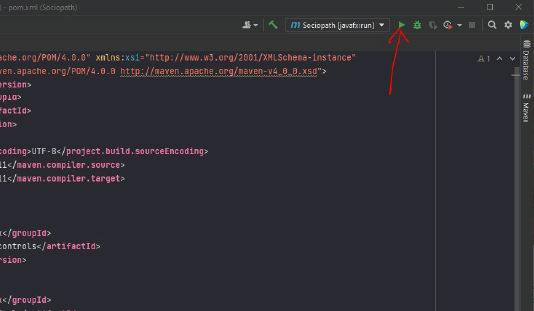
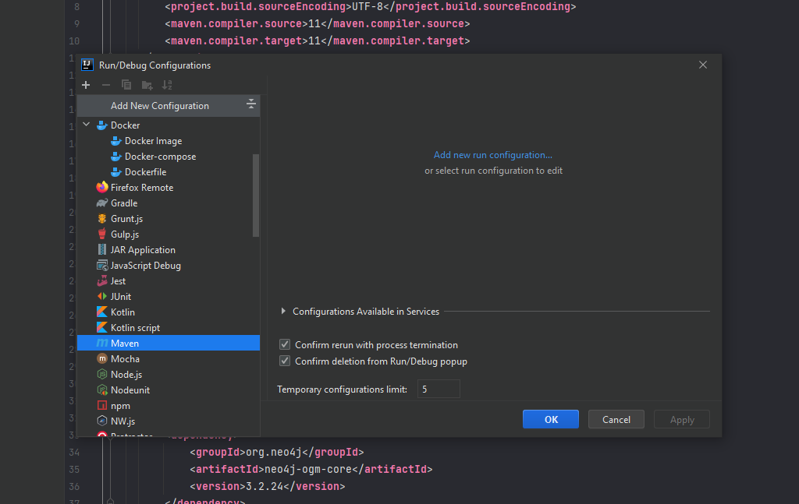
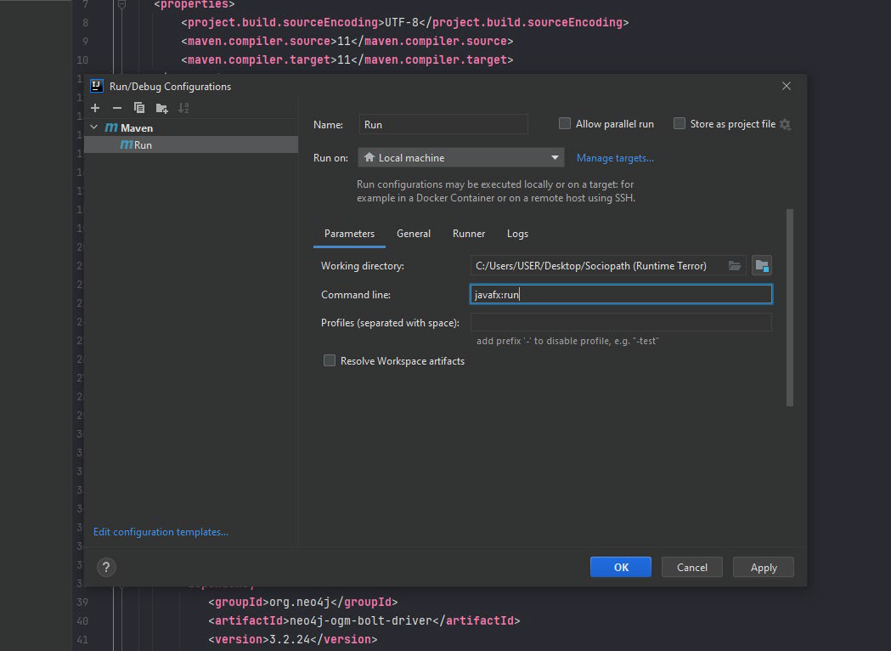
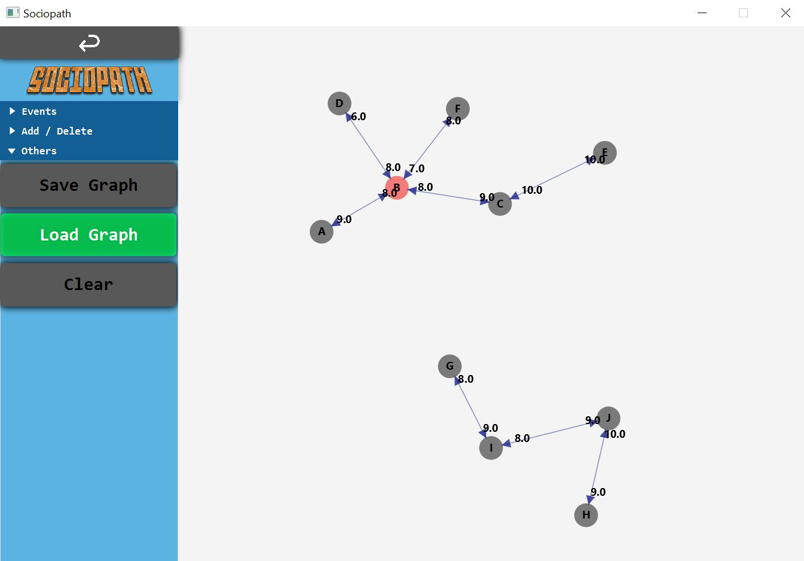

[Sociopath](https://github.com/hongjiaherng/Sociopath.git) is a friendship monitoring system implemented using Graph data structure

## Contributors
    - Hong Jia Herng
    - Lim Hong Zhi
    - Chai Nam Chi
    - Sim Jia Hong

## Libraries used
- JDK 15
- JavaFX 15
- Neo4j Graph Database

## To set up the project in IDE
Intellij IDEA is used as an example (Setup process in other IDE is similar)

1. Load the dependencies from Maven (May take some time)
2. Click 'Add Configuration' at top right menu
     
    

3. Click 'Maven' in the configuration tab
     
    

4. Insert 'javafx:run' in the 'Command Line' field
     
    

5. There you go, the project is ready to run!
     

## Some snip shots 
The nodes are draggable!

